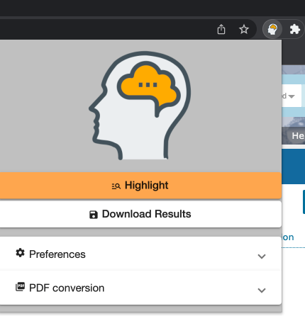
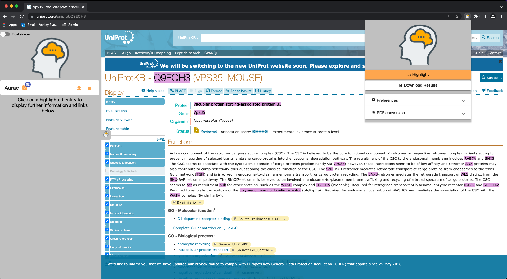
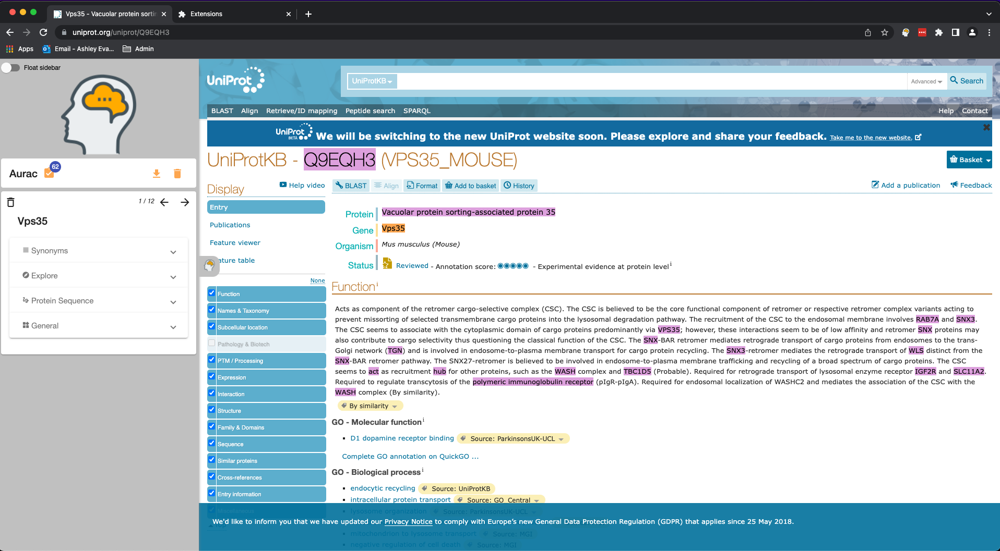
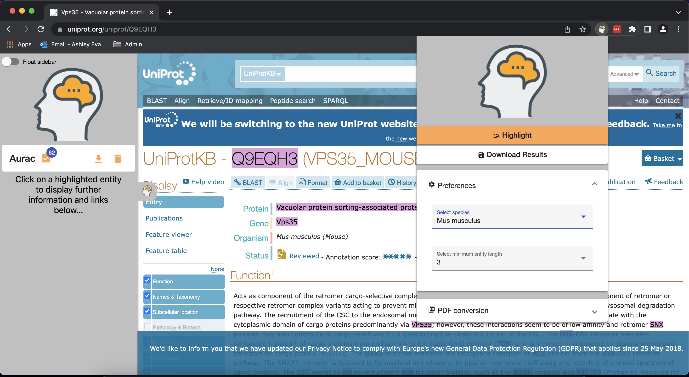
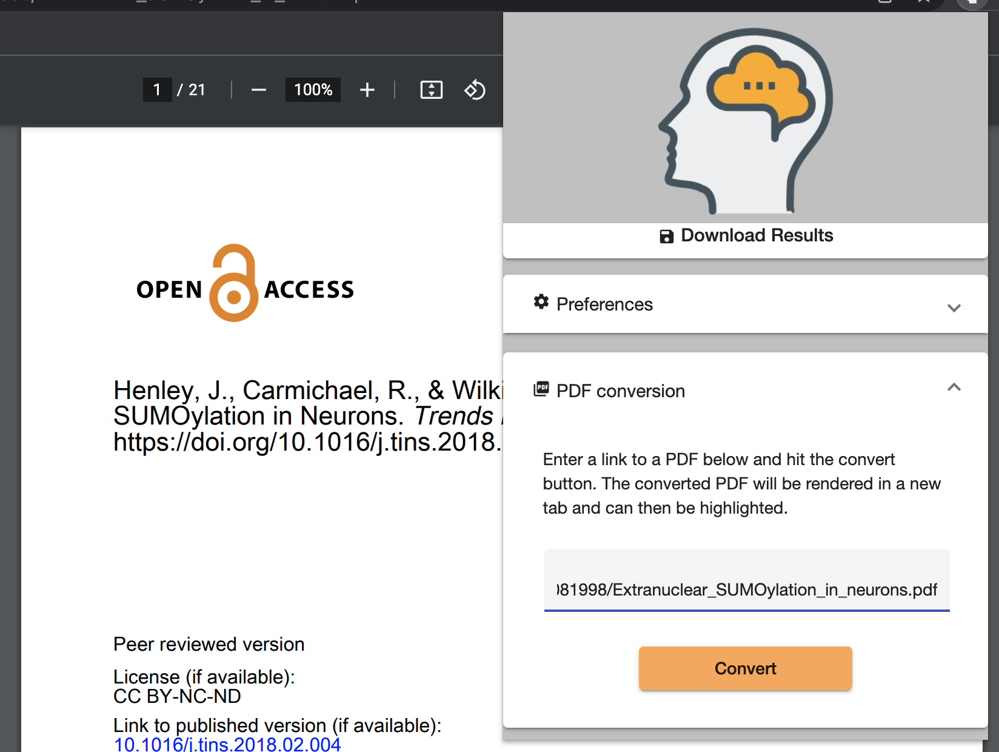

# Bio-Aurac

Bio-Aurac is a web browser plugin designed and created by the Medicines Discovery Catapult (https://md.catapult.org.uk/) to support the scientific and drug discovery community.

## Overview
The purpose of Bio-Aurac is to facilitate a users literature search. This tool can be used to highlight genes and proteins on a highlighted web page/pdf, and provides useful functionality for the user to further explore a gene/protein of interest.

***

## How to use Bio-Aurac
### Requirements - Mac and Windows
1) Install git - https://git-scm.com/book/en/v2/Getting-Started-Installing-Git

2) Install Docker Desktop - https://docs.docker.com/desktop/

### Setup

1) Open terminal

2) Run the following commands in order: 

    - `git clone https://github.com/mdcatapult/bio-aurac.git`
    - `cd bio-aurac`
    - `docker-compose up -d --build`
    This will run the server in the background on your machine allowing the plugin to function. If in the future the plugin does not work the docker-compose command might need to be run again.

#### Supported Browsers

Recent versions of Chrome and Firefox.

#### Using Bio-Aurac in Chrome
1) Open your Chrome browser.

2) Go to this URL - `chrome://extensions/`

3) Activate the `Developer Mode` by using the toggle in the top right hand corner.

4) Click `Load Unpacked`

5) Select the `browser-plugin` folder within the `bio-aurac` project.

6) Bio-Aurac can now be found in your browser extensions (jigsaw at the top right of your browser). You can pin this extension for convenience.

#### Using Bio-Aurac in Firefox

1) Open your Firefox browser.

2) Go to this URL - `about:debugging`

3) Click `This Firefox`

4) Click `Load Temporary Add-On...`

5) Select the `manifest.json` file within the `browser-plugin` folder.

6) Bio-Aurac will appear at the top right of your Firefox browser.

### How to use Bio-Aurac

#### Basic usage

1) Visit the web page that you would like to search for genes and proteins.

2) Click on the Bio-Aurac icon (next to the address bar in your browser) 

3) The Bio-Aurac popup will appear:

4) Click `Highlight` and terms on the page will be highlighed in purple.  A sidebar will also open on the left of the screen on which  you will see a blue circle containing a number representing the number of terms highlighted on the current page.  Under the default configuration, genes and proteins relating to homo sapiens with a length of three characters or greater will be highlighted.

5) Click on a highlighted term to add a card to the sidebar with further information and links on the selected term.

6) Each card contains a number of panels which will expand when clicked:

   - Synonyms: a list of alternative names and identifiers for the clicked term 
   - Explore: a list of clickable links to external resources
   - Protein Sequence: the protein sequence itself, sequence length and sequence mass
   - General: other information relating to the clicked term, e.g. subcellular location

7) Use the arrows in the top right corner of each sidebar card to scroll between synonyms and instances of the clicked term on a page.  Note that this will scroll through all instances of the same term and any synonyms for that gene or protein.

#### Managing the sidebar

- Any number of cards may be added to the sidebar
- A card may be removed from the sidebar by clicking the dustbin icon in the top left corner
- To clear all cards from the sidebar, click the dustbin icon on the right of the sidebar toolbar
- The contents of the sidebar (i.e. all of the information displayed on each individual card) can be downloaded by clicking the download icon on the right of the sidebar toolbar

#### Configuring what Bio-Aurac will highlight

As noted above, the default configuration will highlight genes and proteins related to homo sapiens with a minimum length of 3 characters.  To highlight terms relating to different species or to change the minimum length of terms to be highlighted, open the popup and click `Preferences`:

The following species are currently supported by Bio-Aurac:
- Homo sapiens
- Rattus norvegicus
- Mus musculus
- Saccharomyces cerevisiae
- Drosophilia melanogaster
- Caenorhabditis elegans
- Xenopus tropicalis
- Danio rerio

#### Highlighting a PDF

As well as web pages, Bio-Aurac is able to identify and highlight genes and proteins in pdf documents.  From within the popup click `PDF conversion` and you will be prompted to enter a link (i.e. a web address) to a pdf.  

On entering a link and clicking convert the pdf will be opened in a new browser tab, from where it can be highlighted in the same way as a standard web page.

## Web extension architecture

We wrote a [Medium article](https://medium.com/@nejetherington/building-a-web-extension-in-angular-1f77a5a71b85) outlining the architecture and how we overcame some of the challenges we faced building a web extension in Angular. 

## Contact
Contact us by email at [softwareengineering@md.catapult.org.uk](softwareengineering@md.catapult.org.uk) with any comments or enquiries.  For support please raise a ticket on Github.

## Developers and acknowledgment

- Ian Dunlop
- Nick Etherington
- Ashley Evans
- Mark Laing
- Brad Rollings
- Michael Sweeton
- Alex Whitehorn

All authors contributed equally.

### Credits
Designed using elements from Heroicon and Vecteezy.com.

## Known Issues

- PDF conversion does not currently work in Firefox
- When clicking on the arrow buttons to cycle through instances of a gene or protein on a page those instances are scrolled through alphabetically as opposed to in the order in which they appear on the page.  It can therefore sometimes appear as if a highlighted term has been 'skipped', in reality it hasn't and you will get to every highlight if you keep clicking.

## Contributing
If you would like to contribute to this project please check out the underlying code repositories and submit a pull request:

- [Aurac (browser plugin)](https://github.com/mdcatapult/aurac-web-plugin)
- [Entity recognition](https://github.com/mdcatapult/entity-recognition)
- [PDF converter](https://github.com/mdcatapult/PDF-Converter)

## Licence
This project is licensed under the terms of the Apache 2 license, which can be found in the repository as `LICENCE.txt`.
